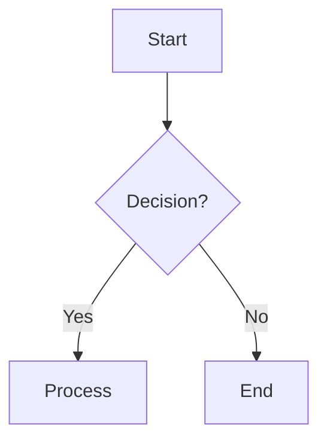

# AzureWikiEdit

A desktop WYSIWYG editor for Azure DevOps Wiki markdown files, with AI-powered editing, visual Mermaid diagram editing, and RAG-based code intelligence.

## Features

### Editor
- Split-pane Markdown/WYSIWYG editing with Toast UI Editor
- Multi-tab support for local files and Azure wiki pages (with session persistence)
- Dark mode with system preference detection and manual toggle
- Find and Replace panel
- Code syntax highlighting (Prism.js)
- Native file operations (New, Open, Save, Save As)

### Azure DevOps Wiki
- Live connection to Azure DevOps wikis via Personal Access Token (PAT)
- Wiki tree browser with lazy loading and favorites
- Page CRUD, rename, and move operations
- Page version history with side-by-side diff comparison and restore
- Save conflict detection and resolution
- `[[_TOC_]]` table of contents placeholder
- Grid Tables (ASCII `+ | -` format)
- Attachment/image upload to Azure
- Wiki tree caching (3-day TTL)

### AI Copilot (Multi-Provider LLM)
- Natural language editing: describe changes and the AI applies them
- Multi-provider support via LangChain.js:
  - Google Gemini
  - OpenAI (GPT-4o)
  - Azure OpenAI
  - Anthropic Claude
- Smart document editing: direct mode for small docs, automatic chunking for large docs (>50K tokens)
- Mermaid diagram generation from natural language descriptions
- Mermaid syntax validation with automatic remediation (up to 3 fix attempts)
- Optional visual verification of rendered diagrams (Puppeteer)
- Q&A mode for asking questions about documents without editing
- Create mode for generating new documents from scratch
- Automatic backup before AI modifications
- Wiki search agent with map-reduce synthesis across pages
- Change preview with diff view before applying

### Mermaid Diagrams
- **17 supported diagram types:** flowchart, swimlane (subgraphs), sequence, state, class, Gantt, pie, ER, mindmap, journey, timeline, gitGraph, C4 Context, quadrant chart, sankey, XY chart, block diagram
- Visual drag-and-drop diagram editor with canvas, toolbar, and live preview
- Diagram type picker for quick insertion
- Auto-layout engine (Dagre-based)
- Pattern-based syntax validation (10+ rules)
- AI-assisted generation and correction
- Mermaid source style based on the [Azure DevOps Mermaid plugin](https://github.com/javiramos1/azure-devops-mermaid)

### Code Indexing & RAG
- Vector database integration (LanceDB + Apache Arrow)
- Catalog manager for creating and managing indexed code collections
- Indexing wizard with quality tiers (draft, medium, high) and streaming LLM output
- File confirmation step with folder tree, checkboxes, and `.gitignore` support
- Language-aware code splitting for 9+ languages (JavaScript, Python, C#, Java, Go, Rust, Bash, PowerShell, etc.)
- Multi-provider embeddings (Azure OpenAI, OpenAI)
- Semantic search across indexed catalogs
- RAG context assembly for AI Copilot queries
- Real-time file watching for external changes
- Crash recovery with task persistence

### Code Analysis
- Directory structure analysis
- Dependency graph extraction (import/export analysis)
- Architecture visualization
- Function and class signature extraction
- AI-powered file summarization

### Local File System
- File browser sidebar with directory navigation
- Full-text file search
- Directory watching for external changes
- Path security validation

## Requirements

- Node.js 18+ (LTS recommended)
- npm 9+
- Azure DevOps account with wiki access (for Azure Wiki features)

## Installation

```bash
# Clone or download this repository
cd AzureWikiEdit

# Install dependencies
npm install

# Start the application
npm start
```

### SSL Certificate Issues (Corporate Networks)

If you encounter SSL certificate errors like `UNABLE_TO_GET_ISSUER_CERT_LOCALLY`:

```bash
# Option 1: Disable strict SSL (temporary, not recommended for production)
npm config set strict-ssl false
npm install

# Option 2: Use your corporate certificate
npm config set cafile /path/to/corporate-ca.crt
npm install
```

## Configuration

### Environment File

Create a `.env` file in the application root (see `sample.env` for all options):

```env
# Azure DevOps Connection
AZURE_ORG=your-organization
AZURE_PROJECT=your-project
AZURE_PAT=your-personal-access-token

# Optional: Specify a wiki (defaults to first wiki found)
AZURE_WIKI_ID=your-wiki-id

# Optional: Root path to limit wiki browsing
AZURE_WIKI_ROOT_PATH=/some/path

# Optional: Start at a specific page
AZURE_WIKI_URL=https://dev.azure.com/org/project/_wiki/wikis/wiki-name/123/Page-Name

# LLM Provider (gemini, openai, azure, anthropic)
LLM_PROVIDER=gemini

# Google Gemini
GEMINI_API_KEY=your-api-key
GEMINI_MODEL=gemini-2.0-flash

# OpenAI
OPENAI_API_KEY=your-api-key
OPENAI_MODEL=gpt-4o

# Azure OpenAI
AZURE_OPENAI_API_KEY=your-api-key
AZURE_OPENAI_ENDPOINT=https://your-resource.openai.azure.com
AZURE_OPENAI_DEPLOYMENT=your-deployment
AZURE_OPENAI_MODEL=gpt-4o
AZURE_OPENAI_EMBEDDING_DEPLOYMENT=text-embedding-3-large

# Anthropic
ANTHROPIC_API_KEY=your-api-key
ANTHROPIC_MODEL=claude-sonnet-4-20250514
```

## Azure DevOps Setup

### Creating a Personal Access Token (PAT)

To connect to Azure DevOps wikis, you need a Personal Access Token (PAT) with the correct permissions.

**Step 1: Navigate to PAT Settings**
1. Sign in to your Azure DevOps organization: `https://dev.azure.com/{your-organization}`
2. Click on your profile icon in the top-right corner
3. Select **Personal access tokens** (or go directly to `https://dev.azure.com/{your-organization}/_usersSettings/tokens`)

**Step 2: Create a New Token**
1. Click **+ New Token**
2. Give it a descriptive name (e.g., "AzureWikiEdit")
3. Set the **Expiration** (recommended: 90 days or custom)
4. Select your **Organization** (or "All accessible organizations")

**Step 3: Set Required Permissions (Scopes)**

| Scope | Permission | Required For |
|-------|------------|--------------|
| **Wiki** | Read & Write | Viewing and editing wiki pages |
| **Code** | Read | Page history and version restore |

To set these permissions:
1. Click **Show all scopes** at the bottom
2. Find **Wiki** and check **Read & Write**
3. Find **Code** and check **Read**
4. Click **Create**

**Step 4: Copy Your Token**
- Copy the generated token immediately (you won't be able to see it again!)
- Store it securely

### Manual Connection

1. Launch the application
2. Go to **Azure > Connect to Wiki** (or press the connect button in the sidebar)
3. Enter your Organization, Project, and PAT
4. Click **Connect**

### Verifying PAT Permissions

1. Go to `https://dev.azure.com/{your-organization}/_usersSettings/tokens`
2. Find your token in the list
3. Click on the token name to view its scopes
4. Ensure you see:
   - **Wiki**: Read & Write
   - **Code**: Read

If permissions are missing, you'll need to create a new token (existing tokens cannot be modified).

### Troubleshooting PAT Issues

| Error | Cause | Solution |
|-------|-------|----------|
| 401 Unauthorized | Invalid or expired PAT | Create a new PAT |
| 403 Forbidden | Missing permissions | Ensure Wiki (Read & Write) scope is set |
| 404 on Page History | Missing Code permission | Add Code (Read) scope to PAT |
| "No wikis found" | Wrong project or no wiki exists | Verify project name and wiki existence |

## Usage

### Keyboard Shortcuts

| Action | Shortcut |
|--------|----------|
| New File | Ctrl+N |
| Open File | Ctrl+O |
| Save | Ctrl+S |
| Save As | Ctrl+Shift+S |
| Toggle Dark Mode | View menu |

### Azure DevOps Wiki Syntax

#### Table of Contents
```markdown
[[_TOC_]]
```
Displays as a placeholder block in the editor.

#### Mermaid Diagrams
~~~markdown

~~~
Renders as an SVG diagram in the preview pane. Use the visual editor for drag-and-drop diagram editing, or ask the AI Copilot to generate diagrams from a natural language description.

## Building Distributables

### Quick Deploy (Recommended)

**Using VS Code:**
1. Open Command Palette (`Ctrl+Shift+P`)
2. Run `Tasks: Run Task`
3. Select `Deploy (Package + Zip)`

**Using Command Line:**
```bash
# Package the application
npm run package

# Create ZIP for distribution (PowerShell)
powershell -Command "Compress-Archive -Path 'out/AzureWikiEdit-win32-x64' -DestinationPath 'out/AzureWikiEdit-win32-x64.zip' -Force"
```

### Output Locations

| Output | Location |
|--------|----------|
| Portable EXE | `out/AzureWikiEdit-win32-x64/AzureWikiEdit.exe` |
| Distributable ZIP | `out/AzureWikiEdit-win32-x64.zip` |

### Corporate Network (SSL Issues)

If you encounter SSL certificate errors during packaging:

```bash
# Windows CMD
set NODE_TLS_REJECT_UNAUTHORIZED=0 && npm run package

# PowerShell
$env:NODE_TLS_REJECT_UNAUTHORIZED=0; npm run package

# Or use the VS Code task: "Deploy (SSL Bypass)"
```

### VS Code Build Tasks

Available tasks (run via `Ctrl+Shift+P` > `Tasks: Run Task`):

| Task | Description |
|------|-------------|
| Start Development | Run the app in dev mode |
| Package Application | Create portable exe |
| Build Distributable | Create installer packages |
| Deploy (Package + Zip) | Create portable exe + ZIP file |
| Deploy (SSL Bypass) | Deploy with SSL verification disabled |
| Clean Build | Remove build artifacts |

### All Build Commands

```bash
# Start in development mode
npm start

# Package for current platform (creates portable exe)
npm run package

# Create installers (requires additional dependencies)
npm run make
```

## Project Structure

```
AzureWikiEdit/
├── package.json              # Dependencies and scripts
├── forge.config.js           # Electron Forge configuration
├── webpack.main.config.js    # Main process webpack config
├── webpack.renderer.config.js # Renderer webpack config
├── webpack.rules.js          # Shared webpack rules
├── .env                      # Local configuration (not committed)
├── sample.env                # Configuration template
├── patches/                  # npm patches (applied via patch-package)
├── tests/
│   └── visual-editor/       # Puppeteer screenshot tests
├── src/
│   ├── main.js               # Electron main process, IPC handlers
│   ├── preload.js             # Secure IPC bridge (contextBridge)
│   ├── renderer.js            # Toast UI Editor init, component setup
│   ├── index.html             # Entry point
│   ├── styles.css             # Global theming and dark mode
│   ├── ai/
│   │   ├── agents/            # Edit agent, doc agent, chunking tools
│   │   ├── analysis/          # Dependency graphs, architecture visualization
│   │   │   └── extractors/    # Language-specific import/signature extractors
│   │   ├── indexing/          # File indexing and summarization pipeline
│   │   ├── prompts/           # System prompts, Mermaid rules, markdown rules
│   │   ├── providers/         # Gemini, OpenAI, Azure, Anthropic
│   │   ├── rag/               # Context assembly and query classification
│   │   ├── splitters/         # Document/code splitters
│   │   │   ├── languages/     # Language-specific chunking (JS, Python, C#, etc.)
│   │   │   └── strategies/    # Semantic chunking and token estimation
│   │   ├── vectordb/          # LanceDB vector store and index management
│   │   ├── llmClient.js       # Unified LLM interface
│   │   ├── llmConfigManager.js # Multi-provider configuration
│   │   ├── mermaidValidator.js # Mermaid syntax validation
│   │   ├── mermaidImageRenderer.js # Puppeteer-based rendering
│   │   ├── markdownValidator.js # Markdown validation
│   │   ├── backupManager.js   # AI edit backups
│   │   ├── wikiSearchAgent.js # Wiki search agent
│   │   └── wikiSynthesisAgent.js # Wiki synthesis agent
│   ├── azure/
│   │   ├── azureClient.js     # Azure DevOps REST API client
│   │   └── configManager.js   # Connection configuration
│   ├── cache/
│   │   └── wikiCache.js       # Wiki tree caching
│   ├── components/
│   │   ├── ai-chat-sidebar.js       # AI Copilot UI
│   │   ├── ai-changes-preview.js    # Diff preview modal
│   │   ├── azure-connection.js      # Azure login modal
│   │   ├── confirmation-dialog.js   # Generic confirmation dialog
│   │   ├── wiki-sidebar.js          # Wiki tree browser
│   │   ├── wiki-search-progress.js  # Wiki search progress UI
│   │   ├── tab-bar.js               # Multi-tab UI
│   │   ├── activity-bar.js          # Sidebar panel switcher
│   │   ├── settings-panel.js        # Settings UI
│   │   ├── find-replace.js          # Find/Replace panel
│   │   ├── history-panel.js         # Version history
│   │   ├── history-compare-dialog.js # Version diff viewer
│   │   ├── image-insert-dialog.js   # Image upload dialog
│   │   ├── save-conflict-dialog.js  # Save conflict resolution
│   │   ├── mermaid-picker.js        # Diagram type selector
│   │   ├── mermaidRendererValidator.js # Mermaid renderer checks
│   │   ├── catalog-manager/         # Vector DB catalog UI
│   │   ├── file-browser/            # Local file browser UI
│   │   ├── indexing-wizard/         # Code indexing wizard
│   │   ├── mermaid-visual-editor/   # Visual diagram editor (canvas, toolbar)
│   │   └── search-panel/            # File search UI
│   ├── file-browser/
│   │   ├── fileSystemManager.js     # File I/O with validation
│   │   ├── fileSearchEngine.js      # Full-text search
│   │   ├── directoryCache.js        # Directory listing cache
│   │   ├── directoryWatcher.js      # Watch for external changes
│   │   └── pathValidator.js         # Security: path validation
│   ├── plugins/
│   │   ├── toc-plugin.js            # [[_TOC_]] handler
│   │   ├── mermaid-plugin.js        # Mermaid rendering
│   │   ├── grid-table-plugin.js     # Grid table placeholder
│   │   └── azure-image-plugin.js    # Image handling
│   ├── styles/
│   │   └── mermaid-visual-editor.css
│   ├── tabs/
│   │   ├── tabManager.js            # Tab state orchestration
│   │   └── tabSessionStore.js       # Tab persistence
│   └── utils/
│       ├── announcer.js             # Screen reader announcements
│       ├── diff-utils.js            # Diff generation
│       └── networkStatus.js         # Network detection
└── README.md
```

## Tech Stack

| Category | Technology |
|----------|-----------|
| Framework | Electron 29 with Electron Forge |
| Editor | Toast UI Editor 3.x |
| Diagrams | Mermaid 10.9, jsPlumb, Dagre (auto-layout) |
| AI/LLM | LangChain.js with Google, OpenAI, Azure, Anthropic providers |
| Vector DB | LanceDB + Apache Arrow |
| Code Parsing | Tree-sitter (WASM) |
| Rendering | Puppeteer (Mermaid-to-image) |
| Bundler | Webpack (via Electron Forge) |
| Language | JavaScript (CommonJS main process, ES6 renderer) |

## License

MIT
